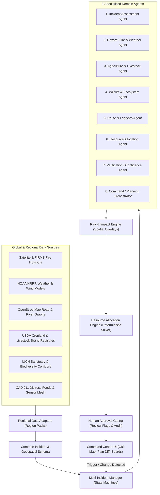

# ECOCRISIS COMMAND

> **Global Multi-Agent AI for Compound Disaster Response, Agricultural Protection & Wildlife Conservation**  
> *Gateways 2026 — Round 1 Architectural & Functional Implementation*

---

## 🌍 Overview

**EcoCrisis Command** is a human-in-the-loop decision-support and multi-incident coordination platform designed for compound environmental crises (e.g. severe wildfires, floods, cyclones). 

When one disaster strikes, it triggers multiple competing emergencies simultaneously:
$$\text{MULTIPLE INCIDENTS} + \text{LIMITED RESOURCES} + \text{FRAGMENTED INFORMATION} + \text{CHANGING CONDITIONS} = \text{COORDINATION PROBLEM}$$

EcoCrisis Command unifies spatial hazard modeling, agricultural crop/livestock inventories, wildlife sanctuary corridors, road accessibility, and fleet telemetry into a single operational intelligence layer.

---

## 🏛️ System Architecture

The architecture maintains a strict separation of concerns:
- **AI Multi-Agents (8 Specialized Agents)**: Perform cross-source spatial reasoning, qualitative risk assessment, natural language briefings, opportunity-cost explanations, and ambiguity resolution.
- **Deterministic Engines (Optimization & Risk Overlays)**: Calculate distances (Haversine with terrain penalties), travel times, capability-matrix scoring, Hungarian constraint optimization, and polygon intersections. **Zero hallucinated numbers or coordinates.**
- **Human-in-the-Loop Gating**: The AI **never** dispatches resources autonomously. Every proposed plan presents an evidence chain, a visual Plan Diff, cross-sector trade-off analysis, and human-attention review flags for authorized responder approval.



---

## 🚀 Live Demo Scenario (Simulated Ground Truth)

### **Phase 1: Initial Multi-Incident Baseline ($T_0$)**
- **Incident I-1 (Critical • Immediate)**: Community Evacuation — Hillside Village & Riverside Households (1,200 people).
- **Incident I-2 (High • Hours)**: Farm & Livestock Emergency — Eastern Slope Farmland (840 cattle, 450 ha crops).
- **Incident I-3 (Medium-High • Hours)**: Wildlife Habitat Emergency — Pine Ridge Sanctuary (Roosevelt Elk & Owl Corridor).
- **Initial Dispatches**:
  - `Evacuation Vehicle A` $\rightarrow$ `I-1`
  - `Transport Team B` $\rightarrow$ `I-2`
  - `Rescue Team C` $\rightarrow$ `I-3`
  - `Rescue Boat 1` $\rightarrow$ `I-1` (Riverside Staging)

---

### **Phase 2: Compound Crisis Event ($T_0 + 10\text{ min}$)**
Simultaneous double failure:
1. **New Incident I-4 (Critical • Immediate)**: North River settlement isolated; primary Highway 27 bridge suffers structural collapse. 410 residents trapped.
2. **Resource Failure**: `Evacuation Vehicle A` suffers catastrophic transmission breakdown (Marked **Unavailable**).

---

### **Phase 3: Multi-Agent Dynamic Replanning**
The system reassesses the entire network without a blind rebuild:
1. **Change Detection**: Identifies that `I-1` lost its primary evacuation vehicle and `I-4` is trapped with no standard road access.
2. **Route Analysis**: Identifies that only heavy 6x6 high-clearance off-road units (`Transport Team B`) can traverse the North River Shore bypass around the collapsed bridge.
3. **Deterministic Solver Execution**:
   - $\text{Transport Team B} \rightarrow \mathbf{I\text{-}4}$ (Reallocated from I-2)
   - $\text{Rescue Team C} \rightarrow \mathbf{I\text{-}1}$ (Reallocated from I-3 to replace disabled Vehicle A)
   - $\text{Rescue Boat 1} \rightarrow \mathbf{I\text{-}1 \text{ \& } I\text{-}4}$ (Corridor widened for amphibious water-side pickup)
   - $\mathbf{I\text{-}2} \text{ (Farm)} \rightarrow \text{Delayed with 3.5 hr safe smoke buffer; defensive sprinkler activated}$
   - $\mathbf{I\text{-}3} \text{ (Wildlife)} \rightarrow \text{Delayed ground crew; aerial thermal drone overwatch and Vet unit on standby}$

---

### **Phase 4: Human-in-the-Loop Authorization & Audit**
- Displays visual **Plan Diff (Before vs. After)**.
- Raises **5 Human Review Flags** for explicit verification.
- Authorized responder signs the plan $\rightarrow$ Dispatches units immediately $\rightarrow$ Records decision into immutable audit ledger.

---

## 💻 Tech Stack

| Layer | Technology | Purpose |
| :--- | :--- | :--- |
| **Frontend** | React 19, TypeScript, Vite, Tailwind CSS v4, Framer Motion | High-density mission control UI |
| **GIS Engine** | MapLibre GL, Vector SVG Canvas Layers, Multi-Layer Controls | Real-time tactical geospatial mapping |
| **State & Synth** | React Context + Web Audio API Synthesizer | Zero-dependency tactical audio feedback & reactive state |
| **Optimization** | Deterministic Cost Matrix, Dijkstra Router, Constraint Solver | Verifiable calculations without LLM hallucinations |
| **Backend API** | Node.js, Express, TypeScript, Zod, PostgreSQL / PostGIS | Modular REST API v1 architecture, state persistence, audit |
| **Testing** | Vitest, Supertest | Unit, solver, database, and API integration testing |

---

## 📡 REST API v1 Specification

All modern operational endpoints are exposed under `/api/v1/`:

| Method | Endpoint | Description |
| :--- | :--- | :--- |
| `GET` | `/api/v1/health` | Service healthcheck, database status, PostGIS availability |
| `GET` | `/api/v1/incidents` | Query active incidents with severity, urgency, and radius filters |
| `GET` | `/api/v1/incidents/:id` | Retrieve detailed incident data with GeoJSON geometry |
| `POST` | `/api/v1/incidents` | Create/ingest incident with Zod schema validation |
| `PATCH`| `/api/v1/incidents/:id` | Update incident status, severity, or sector impact metrics |
| `GET` | `/api/v1/resources` | Query fleet resources with status and type filtering |
| `GET` | `/api/v1/resources/:id` | Retrieve resource capabilities and current location |
| `PATCH`| `/api/v1/resources/:id/status` | Update resource operational status (`Available`, `En Route`, `Unavailable`) |
| `GET` | `/api/v1/plans` | Query generated and historical response plans |
| `GET` | `/api/v1/plans/active` | Retrieve current active response plan with resource assignments |
| `GET` | `/api/v1/plans/:id` | Retrieve plan details, assignments, and itemized plan diffs |
| `GET` | `/api/v1/audit` | Query persistent audit events with pagination and event filters |
| `GET` | `/api/v1/audit/:correlationId` | Retrieve audit trail by request/event correlation ID |
| `GET` | `/api/v1/spatial/layers` | GeoJSON `FeatureCollection` for agricultural and wildlife zones |
| `GET` | `/api/v1/spatial/incidents` | GeoJSON `FeatureCollection` of active incident locations |
| `POST`| `/api/v1/agents/run` | Execute the 8-role sequential multi-agent decision pipeline |
| `GET` | `/api/v1/agents/runs/plan/:planId` | Retrieve agent runs and confidence scores for a plan version |
| `GET` | `/api/v1/agents/findings/run/:runId` | Retrieve itemized findings and evidence records for an agent run |

*Note: Legacy endpoints under `/api/*` (`/api/state`, `/api/health`, `/api/scenario/*`) are temporarily preserved for backwards compatibility.*

---

## 🛠️ Quick Start Guide

### Prerequisites
- Node.js (v18+)
- npm (v9+)
- PostgreSQL 16+ with PostGIS extension (or Docker)

### Installation
```bash
# Clone or navigate to the repository
cd ECO-cri

# Install dependencies
npm install

# Setup Environment Configuration
cp .env.example .env
```

### 🗄️ Database Setup (PostgreSQL + PostGIS)

#### 1. Start PostgreSQL with PostGIS (via Docker)
```bash
docker compose up -d
```
*Note: A native PostgreSQL instance with PostGIS installed can also be used by setting `DATABASE_URL` in `.env`.*

#### 2. Run Database Migrations
Executes the DDL schema in `server/db/schema.sql`, enabling the PostGIS extension, spatial tables, and GiST indexes:
```bash
npm run db:migrate
```

#### 3. Seed Authoritative T0 Baseline Scenario
Hydrates initial incidents (I-1, I-2, I-3), available resources (Vehicle A, Transport Team B, Rescue Team C, Boat 1), spatial layers, and baseline active response plan:
```bash
npm run db:seed
```

### Run Automated Test Suite
Runs all deterministic engine tests and database schema/repository contract tests:
```bash
npm run test
```

### Run Frontend Development Server
```bash
npm run dev
```

Open [http://localhost:5173](http://localhost:5173) in your browser.

### Build for Production
```bash
npm run build
```

---

## 🎨 UI/UX Features & Design System
- **Dark Mode (Default Command Center)**: Deep navy/charcoal `#070c18` surface, tactical emerald accents `#10b981`, glowing status indicators (`#ef4444`, `#f59e0b`, `#3b82f6`, `#a855f7`).
- **Light Mode**: High-contrast tactical white/slate theme accessible via top-bar toggle.
- **Synthesized Audio Engine**: Built-in Web Audio API tactical sound effects for emergency sirens, replan sweeps, and authorization chimes.
- **Interactive Map Layers**: Toggle Fire/Hazard, Incidents, Resources, Evacuation Zones, Agriculture, Wildlife, and Road closures.
- **What-If Sandbox**: Live simulation sliders for wind speed/direction, bridge failures, fleet breakdowns, and objective priority curves.

---
*Developed for Gateways 2026 Round 1.*
